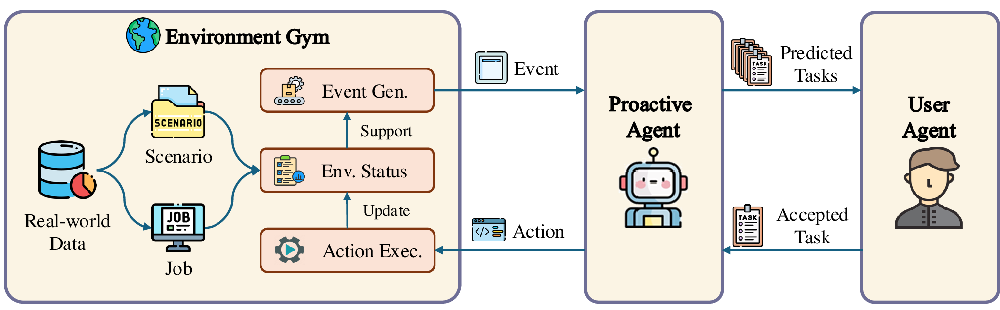

<div align= "center">
    <h1> Proactive Agent </h1>
</div>

<div align="center">


</div>

<p align="center">
  <a href="#overview">Overview</a> •
  <a href="#data">Data Release</a> •
  <a href="#usage">Usage</a> •
  <a href="#citation">Citation</a> •
  <a href="https://arxiv.org/abs/2410.12361">Paper</a> •
  <a href="https://huggingface.co/YancyLee/ProactiveAgent/tree/main">Model</a>
</p>

</div>

## News

- **[2025/03/21]**: The model for Proactive Agent and Reward Agent is released! Check our model at [here](https://huggingface.co/YancyLee/ProactiveAgent/tree/main)!
- **[2025/01/22]**: Our paper was accepted by ICLR 2025.

This project (Proactive Agent) aims to construct a fully active agent, who may anticipate user's requirements and take the initiative, offering assistance and suggesting actions without explicit requests from user. We achieve this by developing a data collection and generation pipeline, building an automatic evaluator and training agent within data generated. For now, we provide the whole collection and generation pipeline, the datasets, and the corresponding evaluation scripts, and the prompts to finetune LLM for proactive agent.

*Read this in [中文](README_zh.md).*
*Read this in [日本語](README_ja.md).*

## Overview

✨Here is an overview of the whole process of Proactive Agent.

<br>
<div align="center">

</div>
<br>


✨✨Features:
- **Environment Sensing**: We provide scripts to collect environment scenes and user activities through Activity Watcher, and recommend tasks automatically based on the model.
- **Assistance Annotation**: We provide a platform to annotate the response generated by the proactive agent, which is a good way to align the result with human annotators.
- **Dynamic Generation**: We provide a dynamic pipeline to generate new data, the feedback from user could affect events afterwards.
- **Construction Pipeline**: We provide a generation pipeline consist of **Environment Gym**, **Proactive Agent** and **Reward Model**, where our Reward Model reaches a `0.918` F1 score on the test set.

A demo is also provided to show the performance of our agent.

https://github.com/user-attachments/assets/81e56660-727f-4ba8-b26c-d28b580a8b0a

In the future, we will continually improve the data quality and increase the coverage of real-world scenarios.

## Data

👐Proactive Agent is intended for coding, writing and daily life scenarios only at present and should not be constructed as reflecting the opinions or views of the creators, owners, or contributors of this dataset. It is distributed under Apache License 2.0. Below is the statistics of the data:

| Settings | Coding | Writing | Daily Life | Total |
|:-------------:|:------:|:-----:|:-----:|:-----:|
|   Inst.Num    | 46 |  46 | 44 | 136 |
|   Events Num  | 2275 |  2354 | 2161 | 6790 |

All the training instances for the Proactive Agent were generated from our [GYM](gym/README.md).
We utilize the [Activity Watcher](https://activitywatch.net/) to collect the human traces across all the scenes, and annotate a test set to validate the effectiveness of the Proactive Agent.
More details about the data collection and annotation can be found [here](dataset/README.md).

## 📦 Installation

Clone this repository and navigate to the proactive demand sensing agent folder
```bash
git clone git@github.com:thunlp/ProactiveAgent
cd ProactiveAgent
```

Install Package
```bash
conda create -n activeagent python=3.10
conda activate activeagent
pip install -r requirements.txt
```

### Install Activity Watcher

- You can go to the [Official Website](https://activitywatch.net/downloads/) to download the main app based on your operating system.
- An extension for chrome is at `./agent/resource/aw-watcher-web.zip`. To download this extension, you will have to download the file and unzip it.
  - For Edge users, go to `edge://extensions/` site, open developer mode and load the extension by clicking `load unpacked`.`
  - For Google Chrome users, go to `chrome://extensions/` site, open developer mode and select `load unpacked` to load the unziped extension.
  - This Extension is not tested under `Safari`.
- There is an official extension for vscode user, you may download it from the [marketplace](https://marketplace.visualstudio.com/items?itemName=activitywatch.aw-watcher-vscode) or search for `aw-watcher-vscode` in the extensions in your vscode and install it.

To check whether the installation is complete, please open your browser and go to `http://localhost:5600/#/timeline` to check if there are four traces displaying in the window(`afk`,`vscode`,`window`,`web`).


## 🚀 Usage

### Configuration
You should first configure the `private.toml` file. The example is given in `example_config.toml`:

```bash
cp example_config.toml private.toml
```

You should change the `default_completions_model`, `api_key` and `base_url` to your own settings.


### Running the Proactive Agent
To experience our proactive agent, you will first enter folder `./agent` and then follow the instructions in [here](agent/README.md).


### Connect the Reward Model
To improve the experience with the Proactive Agent, you can use our built reward model to filter the message from the Proactive Agent.
Here are steps to connect the reward model with the Proactive Agent.
__TO BE UPDATE__


### Interact with the Proactive Agent
Our agent will try to make a proposal by creating a toast on the window, to interact with the proactive agent, you may choose:
- Accept the proposal: you will click on the toast body(Windows) or click the button(MacOS) to let the agent know you accept his idea, the agent will make relavent actions in return.
- Reject the proposal: you will click on the dismiss button(the x on the top right of the toast) to let the agent know you **reject** the proposal, the agent will try to propose in some other way for next turn.
- Ignore the proposal: you will do nothing, the agent will remove the toast for some time depending on the time interval, doing nothing will make the agent know that you are busy and ignored the proposal, the agent will try to make less proposal in the following turns.


## 📊 Model Results
To automatic evaluate the performance of the Proactive Agent, we build a reward model based on our annotated data to judge the performance of the Proactive Agent.
Our reward model reaches a `0.918` F1 score on the test set, which is a good indicator of the performance of the Proactive Agent.

### Reward Model Experiments Results
We test the agreement between the reward model and human annotators on the test set:
- **Missed-Needed (MN)**: The scenario when the user needs help but the agent does not provide help.
- **Non-Response(NR)**: The scenario when the user does not need help and the agent does not prompt any help.
- **Correct-Detection(CD)**: The scenario when the user needs help and the agent provides help.
- **False-Alarm(FA)**: The scenario when the user does not need help but the agent prompts help.

We compare the judgement of the reward model with the human annotators.
We compare the performance of different LLMs and our model on the [test set](eval/README.md#reward-model-evaluation).
The results are as follows:

|                         | GPT-4o  | GPT-4o-mini | LLaMa 3.1 8b | LLaMa 3.1 70b  | ours    |
|-------------------------|---------|-------------|--------------|----------------|---------|
| Missed-Need (MN)        | 0.0333  | 0.5667      | 0.8000       | 0.3333         | 0.8000  |
| Non-Response (NR)       | 1.0000  | 0.5667      | 0.3000       | 0.8333         | 0.8667  |
| Correct-Detection (CD)  | 1.0000  | 0.8667      | 0.9667       | 1.0000         | 1.0000  |
| False-Alarm (FA)        | 0.0000  | 0.3333      | 0.1333       | 0.0667         | 1.0000  |
| Accuracy                | 0.5083  | 0.5833      | 0.5500       | 0.5583         | **0.9167**  |
| Precision               | 0.5042  | 0.5658      | 0.5429       | 0.5340         | **0.9032**  |
| Recall                  | 1.0000  | 0.7167      | 0.6333       | 0.9167         | **0.9333**  |
| F1                      | 0.6704  | 0.6324      | 0.5846       | 0.6748         | **0.9180**  |


### Proactive Agent Experiments Results
In current experiments, we evaluate the performance of the Proactive Agent with our Reward Model.
We define the following metrics:
- **True Positive(TP)**: Instances where the proactive agent correctly predicts a task that the reward model subsequently accepts.
- **False Positive(FP)**: Instances where the proactive agent predicts a task that the reward model does not accept.
- **True Negative(TN)**: Instances where the proactive agent correctly refrains from predicting a task,and the reward model also does not accept any task.
- **False Negative(FN)**: Instances where the proactive agent fails to predict a task that the reward model would have accepted if proposed.

We report the performance of the Proactive Agent on the test set of the [ProactiveBench](eval/README.md).

| Model                  | Recall  | Precision | Accuracy | False-Alarm | F1-Score  |
|:----------------------:|:-------:|:---------:|:--------:|:-----------:|:---------:|
| GPT-4o-mini            | 100.00% | 35.28%    | 36.12%   | 64.73%      | 52.15%    |
| GPT-4o                 | 98.11%  | 48.15%    | 49.78%   | 51.85%      | 64.60%    |
| Claude-3.5-Sonnet      | 97.89%  | 45.37%    | 49.78%   | 54.63%      | 62.00%    |
| LLaMA-3.1-8B           | 98.86%  | 38.16%    | 39.06%   | 61.84%      | 55.06%    |
| LLaMA-3.1-8B-Proactive | 99.06%  | 49.76%    | 52.86%   | 50.24%      | 66.25%    |
| Qwen2-7B               | 98.02%  | 44.00%    | 43.61%   | 56.00%      | 60.74%    |
| Qwen2-7B-Proactive     | 100.00% | 49.78%    | 50.66%   | 50.22%      | 66.47%    |


## Citation
If you find this project useful in your research, please consider citing it:
```
@misc{2024,
  author = {THUNLP},
  title = {ProactiveAgent},
  year = {2024},
  publisher = {GitHub},
  journal = {GitHub Repository},
  howpublished = {\url{https://github.com/thunlp/ProactiveAgent}}
}
```

## Friendly Links
- [ChatDev](https://github.com/openbmb/ChatDev)
- [Activity Watcher](https://activitywatch.net/)
